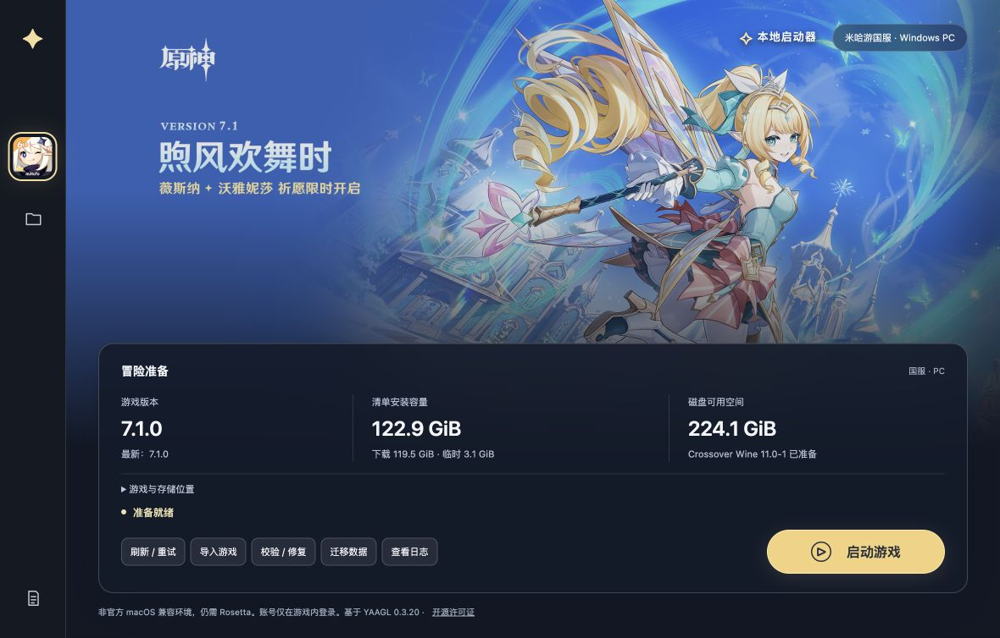

# 原神本地启动器（yuanshen-local-launcher）

面向 **Apple Silicon Mac** 的原神国服 Windows PC 本地启动器。基于 [YAAGL](https://github.com/yaagl/yet-another-anime-game-launcher) 0.3.20 定制，提供中文界面、游戏下载与修复、Wine 环境管理和数据迁移。



## 项目功能

- **安装与更新**：从官方国服 Sophon 服务获取资源，按完整清单逐文件 MD5 校验，只下载缺失或损坏的文件，保留分块缓存并支持失败重试。
- **导入与修复**：导入已有国服游戏目录，校验和修复本地资源。
- **运行环境管理**：固定 Crossover Wine 11.0-1 signed 与 DXMT 654f547，准备环境后启动游戏。
- **退出清理**：后台监测游戏退出，清理当前数据目录的 Wine 残留，恢复运行文件；提供手动清理和失败重试入口。
- **存储迁移**：复制并校验游戏、Wine、配置和缓存到新目录，支持回滚；确认新位置可启动后才能清理旧副本。
- **界面与日志**：中文启动界面、官方插画刷新、本地日志与 macOS 图标适配。

账号仅在游戏内登录，启动器不收集或保存账号密码。游戏资源不包含在仓库中。

## 项目截图

游戏内资源下载画面：


实际进入游戏后的中文图像设置：


截图记录特定版本与设备上的结果，不代表所有 macOS 设备均兼容。

## 环境与当前状态

- 目标平台：Apple Silicon Mac；应用声明最低 macOS 15.0，已记录测试设备为 M1 Pro、32 GB、macOS 27.0.1。
- 需要 Rosetta；Neutralino 壳及 Wine 仍使用 x86 兼容环境。
- 默认设置：1600×900 窗口、60 帧上限、Wine Retina 关闭；下次启动生效，实际帧率取决于游戏设置和机器负载。
- 用户已于 2026-10-02 确认进入游戏并游玩；存在卡顿反馈，性能仍需按设备调整。
- 实际外接硬盘完整迁移、完整原生 GUI 按钮操作及部分视觉效果仍待验证。详细记录见 [验收记录](docs/ACCEPTANCE.md)、[审查报告](docs/REVIEW.md)。

这是非官方 macOS 兼容启动器，与米哈游无隶属或背书关系。国服差分更新接口尚未实现，目前使用完整清单同步，不提供预下载。上游启动器自更新已关闭。启用运行所需的 Steam 兼容 helper 与 timeout fix，无需安装 Steam 客户端；hosts 修改、帧率解锁、ReShade、HDR 等可选功能默认关闭。

## 从源码构建

需要 macOS、Rosetta、Command Line Tools、Node.js 24、pnpm 11、uv 与 ARM64 Python 3.12，无需完整 Xcode。

```bash
pnpm install --frozen-lockfile
LAUNCHER_PYTHON=/path/to/arm64/python3.12 scripts/build.sh
```

将 Python 路径替换为本机 ARM64 Python 3.12。构建脚本准备固定版本的依赖，使用 pnpm / uv 锁文件，重新编译 Sophon 后端并生成应用：

```text
dist/原神本地启动器.app
```

应用仅使用本地 ad hoc 签名，未做 Apple 开发者证书签名或公证。GitHub 下载如需系统已有代理，可为当前构建命令设置 `HTTPS_PROXY`。

打开应用后，按主按钮准备 Wine 并安装游戏，或使用“导入游戏”选择已有国服目录。

## 开发与检查

前端采用 SolidJS、TypeScript、Vite 与 Neutralinojs；本地下载及存储服务采用 Python。

```bash
pnpm run typecheck
pnpm run lint
pnpm test
sophon_server/.venv/bin/python -m unittest discover -s tests
pnpm run build
```

检查前先通过 `scripts/build.sh` 准备生成文件和后端依赖。真实下载和启动验收脚本见 `scripts/acceptance.py`、`scripts/launch-acceptance.py`；不要与应用同时运行，它们会操作实际游戏数据，且不会代替用户登录游戏。

主要目录：

| 目录 | 内容 |
| --- | --- |
| `src/` | 启动器界面、游戏启动与 Wine 管理 |
| `sophon_server/` | 下载服务、存储迁移与退出监测 |
| `scripts/` | 构建、图标适配及验收工具 |
| `tests/` | Python 后端检查 |
| `sidecar/` | 运行辅助工具与许可证 |
| `docs/` | 验收、审查、第三方声明与截图 |

## 数据与外接盘迁移

数据默认存放于 `~/Library/Application Support/GenshinLocalLauncher/data`；位置文件与实例锁位于其上一级目录。应用本体可保留在内置盘。

安装前会重新读取官方清单并检查空间。历史清单与本机占用见 [存储盘点](docs/STORAGE-AUDIT.md)；考虑游戏、语音、Wine 和更新暂存，建议预留 250–350 GB。

1. 退出游戏，停止下载，连接 APFS 格式外接盘。
2. 点击“迁移数据”，选择目标目录，等待复制和校验。
3. 重启应用，使用新位置；失败、取消或校验不通过时保留原数据。
4. 从新位置启动游戏，到达登录界面后退出，点击“确认本次到达登录界面”。
5. 确认成功后可选择“清理旧副本”；此操作永久删除旧副本，需要明确确认。

目标盘必须容纳完整副本和 2 GiB 余量。外接盘离线或卷标识不匹配时，应用会停止启动并提示连接原磁盘，不会自动回内置盘重新下载。回滚保留目标副本。

## 开源许可与致谢

启动器源码沿用 [MIT License](LICENSE)。上游固定提交为 `e293c71ebd41fba74b7c792405d1df0a72e0ec1b`，保留 3Shain 与其他贡献者的版权声明。感谢 YAAGL、Sophon、Neutralinojs、Wine、DXMT 及相关工具作者。

第三方工具遵循各自许可证，详见 [第三方声明](docs/THIRD-PARTY-NOTICES.md)。原神名称、游戏图标、官方插画及截图中的游戏素材归相应权利人所有，不属于 MIT 授权范围。仓库不分发游戏本体、账号数据或下载后的 Wine 环境。
