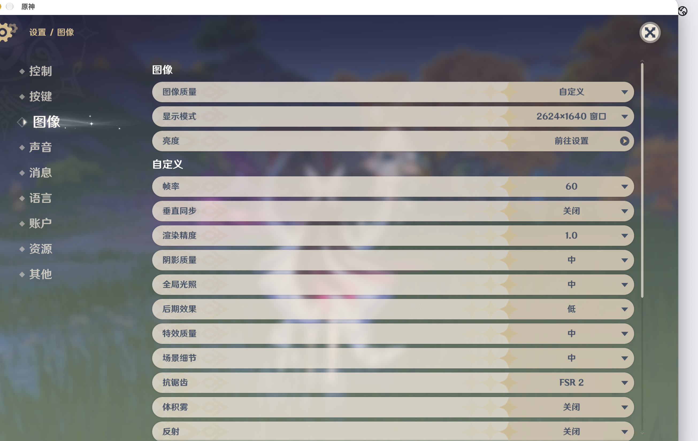

# 验收记录

日期：2026-10-02。环境：M1 Pro、32 GB、macOS 27.0.1、Rosetta、Command Line Tools。

## 当前状态

- 固定 YAAGL 0.3.20 源码提交：已核对。
- 官方国服接口与 Sophon 清单：已实测，版本 7.1.0。
- 类型检查：通过。
- lint：无错误；仍有上游及新代码的类型提示警告，当前 15 项警告。
- 前端命令边界、下载重试、启动错误与环境切换保护：29 项通过。
- 下载服务、恢复与存储自动检查：33 项通过。
- APFS 磁盘映像：复制/校验、取消、校验失败、离线、重接与回滚通过。
- 应用构建：通过，修改后的 Sophon ARM64 后端重新编译，应用本地签名校验通过。
- 完整国服安装：7.1.0 已下载完成，各清单文件经下载器 MD5 校验。
- 原 Wine 11.0 启动：失败，HoYoProtect 缺少 WDFLDR.SYS，exit 5；退出后游戏与 DXMT 备份已恢复。
- Crossover Wine 11.0-1 + Steam helper + timeout fix：已成功打开并渲染游戏内资源下载画面，用户截图确认；不是登录验收。
- 真实游戏启动、登录后进入游戏：通过，用户于 2026-10-02 确认“目前看起来能玩了”，并提供中文游戏内图像设置截图。登录由用户自行完成；目前反馈有卡顿，正在调整画质。
- 退出后再次启动：通过实际源码启动流程；游戏窗口再次出现，关闭后运行流程 exit 0 并完成恢复。完整 GUI 按钮操作另列待验证。
- 实际外接硬盘完整游戏迁移：待验证，用户尚未购置外接盘。

不能将“下载服务正常”“自动检查通过”视为真实游戏启动通过。账号登录和游戏内实际游玩由用户完成。

日志位于 `.build-cache` 和数据目录下 `logs`；日志不保存会话服务令牌。配置与程序源码不包含游戏账号。

## 实测与限制

- 2026-10-02 数据目录占用约 129 GiB，游戏内资源下载仍会增长；应用包约 114 MiB，开发缓存 `.build-cache` 清理后约 15 MiB。
- 按用户残留清理要求，旧失败 Wine、归档及编译中间文件已清理，约 4.01 GiB；当前游戏、Wine、prefix 和下载缓存保留，见 CLEANUP.md。
- Crossover 归档 SHA256：`89fa7e90fb626523a90d5867a03c6be785d017176739c6320a3b86c7838c3a35`，与官方 GitHub 发布资产 digest 一致。
- Neutralino 主进程 PID、实例锁、自动重启与服务退出已实测。主界面渲染、官方清单就绪有日志；窗口读取工具对该自定义应用持续超时，完整 GUI 按钮操作尚未验收。
- `.build-cache/frontend-tests.log`、`python-tests.log`、`final-build.log`、`final-package.log` 保存自动检查与构建证据；`crossover-launch-acceptance.log` 和游戏日志保存真实启动流程。

用户提供的游戏资源下载画面：

## 用户追加适配

- 默认 60 帧上限、1920×1080 窗口、Wine Retina 关闭；下次启动生效。
- 启动器使用原神图案、完整 ICNS 尺寸；游戏使用 Crossover 原生圆角留白遮罩。独立原生输出检查和带 CX_ROOT 的 Wine cmd 检查通过。
- 29 项前端检查通过。实际 Dock 图标、1080p 和降温效果需退出并重新启动游戏后确认。
- 当前游戏仍下载资源，数据目录约 146 GiB；本次清理不删除游戏数据。

## 用户实际游玩确认

用户已进入游戏，并打开中文图像设置。截图显示 2624×1640 窗口、60 帧、渲染精度 1.0、阴影/全局光照/特效/场景细节中，反射和体积雾关闭。当前仍是此前启动的游戏进程，新启动器的1080p设置尚未进行重启实测。

## 退出清理最终验证

用户从游戏菜单退出后，复现 YuanShen、Steam helper、wineserver 和 winedevice 残留。Wine 仍保留 Cocoa 窗口记录，因此 CoreGraphics 方案已弃用。
最终方案使用固定 Wine 自带的 `winedbg --command 'info wnd'` 查询窗口表，不传目标 PID、不附加调试器。仅当前数据目录中的游戏和 Wine；先观察可见 Unity 窗口，再连续 6 次关闭观察才清理。未知、超时或损坏输出不判为退出；最小化的 WS_VISIBLE 保持。

- 用户菜单退出：Windows 窗口确已销毁，修正后的查询连续返回关闭并自动终止残留；过程中发现无 server 时 `-k` 返回 1，现已修复并完成备份恢复。
- 最终再启动：窗口由初始化的 false/null 转为 true；使用 Wine `taskkill /IM YuanShen.exe`（无 `/F`，仅发送 WM_CLOSE）关闭真实游戏窗口后，源码运行流程 exit 0。
- 游戏 3 个文件与 Wine/DXMT 3 个文件恢复；`.bak`、`patched` 标记和 `config.bat` 清除；本项目 Wine 进程为 0。
- 已退出 server 的重复 stop 实测通过；晚连接、查询挂起、手动中断、未知类名和恢复失败互斥均有回归检查。
- 前端 29 项、后端 33 项通过；类型检查和 lint 通过（15 个警告，0 错误）；最终应用签名校验通过。
- 原生应用重新打开后，日志确认主界面已渲染、国服清单已就绪。完整 GUI 按钮操作仍待验证。
- 实际外接 SSD 完整游戏迁移仍待验证。

证据：`.build-cache/automatic-exit-final.log`、`game-window-close.log`、`exit-recovery.log`、`exit-final-state.json`、`exit-frontend-tests.log`、`exit-python-tests.log`、`exit-reviewed-build.log`。

当前游戏与运行环境约146 GiB。后续用户反馈1920×1080窗口遮挡Dock，默认已改为1600×900，60帧上限、Retina关闭。最终游戏注册表确认1600×900窗口模式。实际画面避让Dock的视觉确认仍待用户反馈。

## 界面留白和自动插画更新

- 移除与官方插画标题重复的宣传文案，将启动器标识移到右上，插画按宽度显示，增加信息面板间距。
- 启动与“刷新 / 重试”异步检查官方当前插画；不等待插画即可操作游戏。下载限定 HTTPS、官方 CDN、超时和大小上限，验证图像后替换；失败保留当前或打包的背景，临时文件自动删除。页面 CSP 保持原有 local/data 图像限制。
- 类型检查、打包通过；前端 33 项（含插画成功、无效地址、下载失败和损坏图像）、后端 33 项通过；相关 lint 0 错误、11 项已有非空断言警告。
- 官方插画接口与原生 curl 下载实测通过；1180×754 和480px窄窗口浏览器预览通过。完整原生 GUI 中自动背景切换仍待验证。
- 存储只读盘点见 STORAGE-AUDIT.md，未删除缓存或语音包；真实外置盘游戏迁移仍待验证。

## 后台退出清理与 Dock 留白修复

2026-10-02 再次复现：用户菜单退出后，游戏日志记录 OnApplicationQuit，Windows 窗口表没有 UnityWndClass，但 YuanShen、Steam helper、wineserver、winedevice 仍残留。旧版清理依赖 WebView JavaScript 轮询，后台暂停时不能保证及时执行。

- 退出监测改由打包的 Sophon 后台线程执行。先观察可见游戏窗口，再连续6次确认关闭；未知、异常及最小化不触发清理。仅停止当前数据目录的 WINEPREFIX。
- 启动结束时取消并等待旧监测线程退出；恢复状态再次检查通过后才释放运行互斥，避免旧监测干扰下一次启动。
- 自动清理开始与成功分开；成功清理造成的 Wine 返回码1不再作为启动失败，清理失败仍保留错误与恢复保护。
- 真实原生后端测试：暂停 Node 前端进程30秒，期间不执行前端代码或 HTTP 轮询；正常 WM_CLOSE 后后台清理全部本项目 Wine 进程。文件尚未恢复时拒绝新启动；恢复前端后运行流程返回0，6文件 SHA256与原始记录一致，无 `.bak`、patched 标记或 config.bat。
- 前端34项、后端39项通过；类型检查、修改后的 ARM64 后端编译和应用打包通过；lint 0错误、16个警告；应用签名校验通过。独立审查发现的线程取消竞态、异常状态缓存及失败误判均已修复并复查。
- 根据用户 Dock 遮挡反馈，默认改为1600×900窗口、60帧、Retina关闭。真实启动配置已使用900p；完整画面与 Dock 的视觉留白仍待用户确认。

证据：`.build-cache/native-exit-real-result.json`、`native-exit-real-test.log`、`native-exit-real-launch.log`、`native-exit-service.log`、`native-exit-python-tests.log`、`native-exit-tests.log`、`native-exit-build.log`、`native-exit-package.log`。实际外接盘迁移仍待验证。

## 用户菜单退出后残留的补充修复

17:16 的实际退出日志有本轮 `OnApplicationQuit` 记录，Wine 窗口表已无Unity窗口，但所有者游戏、Steam helper、wineserver、winedevice仍在。状态追踪发现按上一轮样本没有观察到窗口，退出计数一直为零。

- 新增当前 WINEPREFIX 国服 `output_log.txt` 退出事件兜底：只采纳本次启动后精确的 Unity `OnApplicationQuit` 记录；仍需连续6次窗口关闭状态。可见或未知窗口会继续阻止停止。
- 后台转态记录保存在 `data/logs/exit-watchdog.log`，仅包含窗口状态、退出事件和时间，方便下次直接定位。
- 新版最终应用已打包并打开；6个备份 SHA256 与原件一致，无 Wine进程、`.bak`、`patched` 标记或 `config.bat`。
- 新增用户退出日志的时间范围、相似文本、未观察到窗口时仍可清理、窗口未知时禁止停止等测试。后端42项、前端34项通过；类型检查通过，lint 0错误、16项警告；ARM64后端编译、签名与打包通过。
- 打包后 WM_CLOSE 真实游戏验收：暂停Node前端30秒，期间原生后台监测自行结束Wine；恢复前端后程序退出码0，6个文件校验通过。该测试验证后台停止和恢复；用户菜单退出兜底由本轮实际日志及42项源测试验证。
